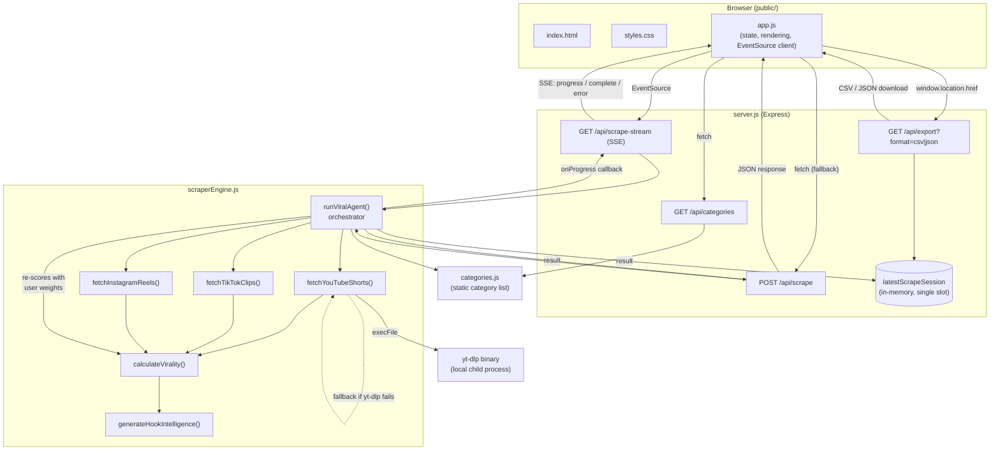

# Architecture

ViralScout is a small Express app that simulates an "AI agent" scraping YouTube
Shorts, TikTok, and Instagram Reels for viral clips in a chosen category, scores
each clip's virality, and renders the results in a browser dashboard. There is no
database, no build step, and no framework on the frontend — just static files
served by Express and three backend modules.

## Diagram



### Fallback (Mermaid-free) view

```
Browser (public/app.js)
   |  fetch/EventSource/link-navigation
   v
server.js (Express routes)
   |  GET /api/categories        -> categories.js
   |  POST /api/scrape           -> scraperEngine.runViralAgent()  --> JSON response
   |  GET /api/scrape-stream     -> scraperEngine.runViralAgent()  --> SSE (progress/complete/error)
   |  GET /api/export            -> reads latestScrapeSession (in-memory cache) --> CSV/JSON download
   v
scraperEngine.js
   runViralAgent(category, timeRange, platforms, weights, onProgress)
     |-- fetchYouTubeShorts()   --(execFile)--> local yt-dlp binary --(fallback)--> fabricated clips
     |-- fetchTikTokClips()     --> hardcoded per-category dataset
     |-- fetchInstagramReels()  --> hardcoded per-category dataset
     |     each clip -> calculateVirality() + generateHookIntelligence()
     |-- merge all clips, re-score with caller's weights, sort by velocityScore, rank
     v
   result { category, timeRange, clips[], totalClips, timestamp }
```

## Components

### `categories.js`
Static array of 8 content categories (id, name, icon, description, tags,
search terms). Drives both the category picker UI and the search terms used
by the YouTube scraper.

### `scraperEngine.js`
All scraping/generation and scoring logic, exported as `runViralAgent`,
`calculateVirality`, `generateHookIntelligence`.

- **`runViralAgent`** — the orchestrator. Resolves the category, converts
  `timeRange` (`24h`/`3d`/`7d`/`30d`) into an hour window, calls the three
  platform fetchers for whichever platforms were requested, merges all
  clips, re-scores everything with the caller-supplied `weights`, sorts by
  `velocityScore` descending, and assigns ranks. Emits progress messages via
  an optional `onProgress` callback at each stage, which `server.js` forwards
  as SSE events.
- **`fetchYouTubeShorts`** — the only path that touches real data. Shells out
  to a hardcoded local `yt-dlp` binary path via `execFile` to search YouTube
  Shorts. If `yt-dlp` fails or returns no results, it falls back to
  `generateFallbackYouTubeShorts`, which fabricates plausible clips from
  templates.
- **`fetchTikTokClips`** / **`fetchInstagramReels`** — always synthetic.
  Return clips drawn from hardcoded per-category datasets (with a generic
  fallback pool for categories not explicitly listed). No real network calls.
- **`calculateVirality`** — computes a 0–100 composite "velocity score" from
  views/hour, like/comment/share ratios, and a recency boost, then buckets it
  into a viral tier (Supernova/Trending/Rising/Momentum). Runs twice per clip
  per request: once with default weights inside each fetcher, then again in
  `runViralAgent` with the caller's actual weights — the second result wins.
- **`generateHookIntelligence`** — deterministically hashes the clip title to
  pick a "hook type," retention driver, psychological trigger, and audio
  trend from fixed lists. Presentation flavor, not real content analysis.

### `server.js`
Express app and all HTTP routes. No database — one in-memory variable,
`latestScrapeSession`, caches the most recent scrape result (process-local,
single-slot, shared across all clients, reset on restart).

- `GET /api/categories` — returns the static category list.
- `POST /api/scrape` — runs `runViralAgent` synchronously, returns full JSON.
- `GET /api/scrape-stream` — same agent run, streamed as Server-Sent Events
  (`progress` / `complete` / `error`), driven by the `onProgress` callback.
- `GET /api/export?format=csv|json` — exports `latestScrapeSession` (a scrape
  must have run first); CSV is hand-built rather than via a library.

### `public/` (frontend)
Plain static assets served directly by Express — no bundler, framework, or
module system.

- **`app.js`** — single `state` object plus a cached `elements` DOM-ref map.
  Wires up category/time-range/platform selection and weight-tuning sliders,
  starts scraping via `EventSource` against `/api/scrape-stream` (falling
  back to a plain `fetch` POST to `/api/scrape` on stream error), and renders
  results as both a card grid and a table, plus a modal with an embedded
  YouTube player (or a "watch on platform" link for TikTok/Instagram) for
  per-clip breakdowns.
- **`index.html`** / **`styles.css`** — markup and styling for the dashboard.

## Request lifecycle (typical scrape)

1. Browser loads `index.html`/`app.js`; `app.js` fetches `/api/categories` to
   populate the category picker.
2. User picks a category, time range, platforms, and optionally tunes scoring
   weights, then clicks "Launch Viral Agent Scraper."
3. `app.js` opens an `EventSource` to `/api/scrape-stream` with the selected
   params in the query string.
4. `server.js` calls `runViralAgent(...)`, passing an `onProgress` callback
   that writes SSE `progress` events back to the client as each crawler stage
   completes.
5. `runViralAgent` fetches clips per platform (real for YouTube via `yt-dlp`
   when available, synthetic otherwise), scores and ranks them, and returns
   the final result.
6. `server.js` caches the result in `latestScrapeSession` and sends an SSE
   `complete` event with the full payload.
7. `app.js` renders the summary metrics banner, clip grid/table, and enables
   CSV/JSON export links that hit `/api/export`, which serves whatever is in
   `latestScrapeSession`.
8. If the SSE connection errors instead, `app.js` falls back to a plain
   `POST /api/scrape` request and renders the JSON response the same way.
